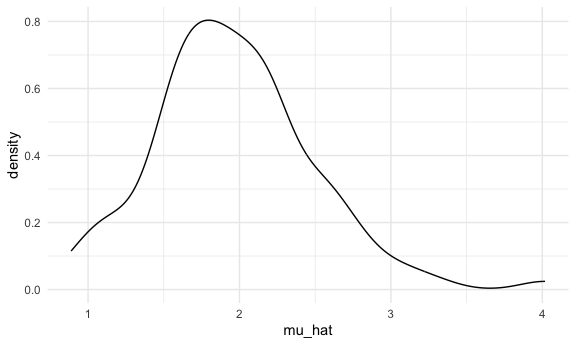
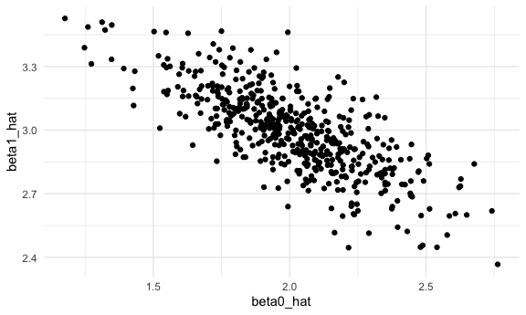

Simulations
================
Selina Lyu

## Let’s simulate something

I have function:

``` r
sim_mean_sd = function(n, mu = 2, sigma = 3) {
  
  sim_data = tibble(
    x = rnorm(n, mean = mu, sd = sigma),
  )
  
  sim_data |> 
    summarize(
      mu_hat = mean(x),
      sigma_hat = sd(x)
    )
}
```

I can simulate by running this line

``` r
sim_mean_sd(30)  #each time yield different result, sample from a population
```

    ## # A tibble: 1 × 2
    ##   mu_hat sigma_hat
    ##    <dbl>     <dbl>
    ## 1   2.25      2.77

## Let’s simulate a lot

start with a for loop

``` r
output = vector("list", 100) #do 100 times

for (i in 1:100) {
  output[[i]] = sim_mean_sd(30)
}

sim_results = bind_rows(output)
```

Let’s use a loop function

``` r
sim_results =
  map(1:100, ~ sim_mean_sd(30))|>
  bind_rows()

sim_results_df = 
  expand_grid(
    sample_size = 30,
    iter = 1:100
  ) |> 
  mutate(
    estimate_df = map(sample_size, sim_mean_sd)
  ) |> 
  unnest(estimate_df)
```

look at results:

``` r
sim_results_df |> 
  ggplot(aes(x = mu_hat)) + 
  geom_density()
```



``` r
sim_results_df |> 
  pivot_longer(
    mu_hat:sigma_hat,
    names_to = "parameter", 
    values_to = "estimate") |> 
  group_by(parameter) |> 
  summarize(
    emp_mean = mean(estimate),
    emp_sd = sd(estimate)) |> 
  knitr::kable(digits = 3)
```

| parameter | emp_mean | emp_sd |
|:----------|---------:|-------:|
| mu_hat    |    1.962 |  0.529 |
| sigma_hat |    3.014 |  0.408 |

SLR for 1 n:

``` r
sim_regression = function(n, beta0 = 2, beta1 = 3) {
  
  sim_data = 
    tibble(
      x = rnorm(n, mean = 1, sd = 1),
      y = beta0 + beta1 * x + rnorm(n, 0, 1)
    )
  
  ls_fit = lm(y ~ x, data = sim_data)
  
  tibble(
    beta0_hat = coef(ls_fit)[1],
    beta1_hat = coef(ls_fit)[2]
  )
}
```

``` r
sim_results_df = 
  expand_grid(
    sample_size = 30,
    iter = 1:500
  ) |> 
  mutate(
    estimate_df = map(sample_size, sim_regression)
  ) |> 
  unnest(estimate_df)

sim_results_df |> 
  ggplot(aes(x = beta0_hat, y = beta1_hat)) + 
  geom_point()
```



SLR for several ns:

``` r
sim_results_df = 
  expand_grid(
    sample_size = c(30, 60, 120, 240),
    iter = 1:1000
  ) |> 
  mutate(
    estimate_df = map(sample_size, sim_mean_sd)
  ) |> 
  unnest(estimate_df)
```

``` r
sim_results_df |> 
  mutate(
    sample_size = str_c("n = ", sample_size),
    sample_size = fct_inorder(sample_size)) |> 
  ggplot(aes(x = sample_size, y = mu_hat, fill = sample_size)) + 
  geom_violin()
```


``` r
sim_results_df |> 
  pivot_longer(
    mu_hat:sigma_hat,
    names_to = "parameter", 
    values_to = "estimate") |> 
  group_by(parameter, sample_size) |> 
  summarize(
    emp_mean = mean(estimate),
    emp_var = var(estimate)) |> 
  knitr::kable(digits = 3)
```

    ## `summarise()` has grouped output by 'parameter'. You can override using the
    ## `.groups` argument.

| parameter | sample_size | emp_mean | emp_var |
|:----------|------------:|---------:|--------:|
| mu_hat    |          30 |    1.973 |   0.311 |
| mu_hat    |          60 |    2.015 |   0.147 |
| mu_hat    |         120 |    1.993 |   0.079 |
| mu_hat    |         240 |    1.999 |   0.039 |
| sigma_hat |          30 |    2.977 |   0.149 |
| sigma_hat |          60 |    2.995 |   0.079 |
| sigma_hat |         120 |    2.992 |   0.037 |
| sigma_hat |         240 |    2.994 |   0.019 |

## Try other sample sizes

``` r
n_list = 
  list(
    "n = 30" = 30,
    "n = 60" = 60,
    "n = 120" = 120,
    "n = 240" = 240
  )

output = vector("list", length = 4)

output[[1]] = map(1:100, ~ sim_mean_sd(n = n_list[[1]])) |> bind_rows()

for (i in 1:4){
  output[[i]] = map(1:100, ~ sim_mean_sd(n = n_list[[i]])) |>
  bind_rows()
}
```
